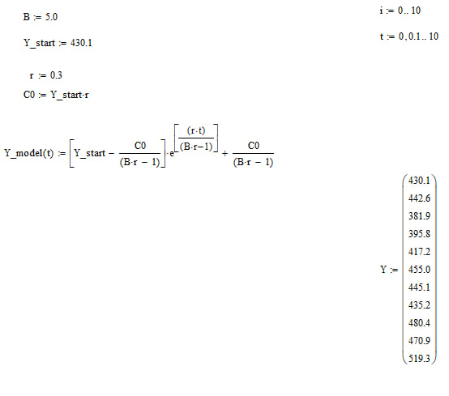

# 📈 Harrod-Domar Model in Mathcad

Реалізація та калібрування динамічної моделі економічного зростання Харрода-Домара в середовищі **Mathcad Prime** на основі реальних макроекономічних даних ВВП Австрії.

---

## ⚡ Етапи калібрування та нестабільність системи

1. **Фаза спаду ($B = 2.5$):** За умови $B \cdot r < 1$ модельна крива стрімко падала в мінус (до $-516.114$), що повністю суперечило зростанню реального ВВП.
2. **Зона колапсу ($B = 3.5$):** Через критично малий знаменник система втратила стабільність, а значення впали до $\approx -3 \cdot 10^{29}$, викликаючи зависання обчислювального сервера Mathcad (*Server Busy*).
3. **Оптимальна модель ($B = 5.0$):** Шляхом ітераційного підбору параметр капіталомісткості було збільшено до $5.0$. Показник експоненти став додатним, і тренд розвернувся вгору за фактичними точками.

---

## 📊 Візуалізація роботи

### 1. Структура математичної моделі

### 2. Фінальний калібрований графік порівняно з ВВП Австрії

